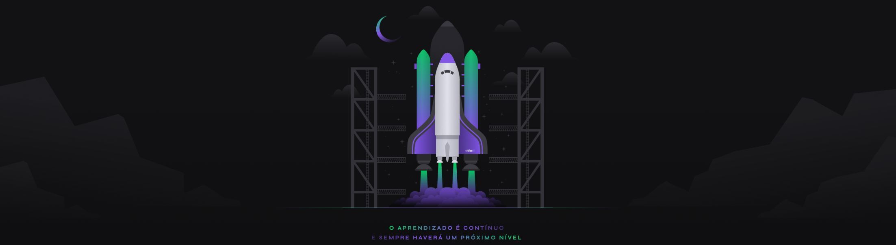

Código para o desafio : 
#rumoaoproximonivel

   

<!-- ******************************* Título do Projeto ****************************************  -->
<h1 align="center" > Next Level Week 04 - Projeto Move.IT </h1>

<!-- *******************************  Status do Projeto  **************************************  -->

   Status do Projeto :  🚧 Projeto em Construção  🚧

 
<!-- ************************************  Badges  ********************************************  -->

  

  

  
  

<!-- ******************************* Ancoras **************************************************  -->

  <a href="#sobre">Sobre o Projeto</a>&nbsp;&nbsp;&nbsp;|&nbsp;&nbsp;&nbsp;
  <a href="#cronograma">Cronograma do Projeto</a>&nbsp;&nbsp;&nbsp;|&nbsp;&nbsp;&nbsp;
  &nbsp;&nbsp;&nbsp;|&nbsp;&nbsp;&nbsp;
  &nbsp;&nbsp;&nbsp;|&nbsp;&nbsp;&nbsp;
  &nbsp;&nbsp;&nbsp;|&nbsp;&nbsp;&nbsp;

<!-- ******************************* Sobre ***************************************************  -->

<h2 id="sobre"> 🚀 Sobre o Projeto </h2>
Descrição do que é e para que serve o projeto que foi desenvolvido.

<h2 id="cronograma"> 📆 Cronograma do Projeto</h2>

   

